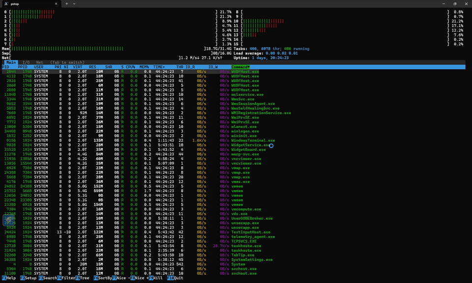

<p align="center">
<pre>
██████╗ ███████╗████████╗ ██████╗ ██████╗
██╔══██╗██╔════╝╚══██╔══╝██╔═══██╗██╔══██╗
██████╔╝███████╗   ██║   ██║   ██║██████╔╝
██╔═══╝ ╚════██║   ██║   ██║   ██║██╔═══╝
██║     ███████║   ██║   ╚██████╔╝██║
╚═╝     ╚══════╝   ╚═╝    ╚═════╝ ╚═╝
</pre>
</p>

<h3 align="center">The <code>htop</code> alternative for Windows PowerShell.</h3>

<p align="center">
  <strong>Beautiful, fast, real-time system monitor for Windows. Built in Rust.</strong>
</p>

<p align="center">
  <a href="#installation">Install</a> •
  <a href="#features">Features</a> •
  <a href="#keybindings">Keys</a> •
  <a href="#color-schemes">Themes</a> •
  <a href="#configuration">Config</a> •
  <a href="#license">License</a>
</p>

<p align="center">
  <a href="https://crates.io/crates/pstop"></a>
  <a href="https://community.chocolatey.org/packages/pstop"></a>
  <a href="https://github.com/microsoft/winget-pkgs/tree/master/manifests/m/marlocarlo/pstop"></a>
  
  
  
  
</p>

---

<p align="center">
  
</p>

---

## Why pstop?

If you've ever missed `htop` on Windows, your search is over. **pstop** brings the full htop experience to Windows PowerShell. No WSL, no Cygwin, no compromises.

| | **pstop** | Task Manager | `Get-Process` |
|---|:---:|:---:|:---:|
| Real-time CPU per-core bars | ✅ | ❌ | ❌ |
| Memory / Swap / Network bars | ✅ | Partial | ❌ |
| GPU utilization & VRAM bars | ✅ | Basic | ❌ |
| Tree view (process hierarchy) | ✅ | ❌ | ❌ |
| Search & filter processes | ✅ | Basic | ❌ |
| Kill / change priority | ✅ | ✅ | Manual |
| Mouse support | ✅ | ✅ | ❌ |
| 7 color schemes | ✅ | ❌ | ❌ |
| Keyboard-driven | ✅ | ❌ | ❌ |
| Runs in terminal | ✅ | ❌ | ✅ |
| ~1 MB binary, zero dependencies | ✅ | N/A | N/A |

---

## Installation

### WinGet (Recommended)

```powershell
winget install marlocarlo.pstop
```

### Chocolatey

```powershell
choco install pstop
```

### Cargo (crates.io)

```powershell
cargo install pstop
```

> **Don't have Rust/Cargo?** Install it in seconds: <https://rustup.rs>

### From GitHub Releases

Download the latest `.zip` from [GitHub Releases](https://github.com/marlocarlo/pstop/releases), extract, and add to your `PATH`.

### From Source

```powershell
cargo install --git https://github.com/marlocarlo/pstop
```

### Build Locally

```powershell
git clone https://github.com/marlocarlo/pstop.git
cd pstop
cargo build --release
# Binary at: target/release/pstop.exe + target/release/htop.exe
```

All methods install **both** `pstop` and `htop` commands. Yes, you can just type `htop` on Windows.

### Add htop Alias (Optional)

If you only installed `pstop` and want the `htop` alias in your PowerShell profile:

```powershell
pstop --install-alias
```

This adds `Set-Alias htop pstop` to your `$PROFILE` automatically.

---

## Features

### 🖥️ Per-Core CPU Monitoring
Real-time CPU usage bars for every logical core, color-coded by usage type (user / system / virtual), exactly like htop. CPU columns auto-adjust based on core count (2/4/8/16 columns) and terminal size — just like htop's `calcColumnWidthCount`.

### 📊 Memory, Swap, Network & GPU Bars
- **Mem** bar: shows used (green), buffers (blue), cached (yellow)
- **Swap** bar: swap usage with color threshold
- **Net** bar: live RX/TX throughput in the header
- **GPU** bar: overall GPU utilization percentage (shown on GPU tab)
- **VMem** bar: dedicated video memory usage (shown on GPU tab)

### 🌳 Tree View
Press `F5` or `t` to toggle process tree view — see parent-child relationships with `├─` / `└─` tree connectors, collapsible nodes with `+`/`-`.

### 🔍 Search & Filter
- **F3** - Incremental search: jumps to matching process
- **F4** - Filter: hides all non-matching processes in real-time

### 📋 Four Tab Views
- **Main** - Full process table (PID, USER, CPU%, MEM%, TIME+, Command...)
- **I/O** - Disk read/write rates per process
- **Net** - Per-process network bandwidth (live download/upload rates with auto-scaling B/s, KB/s, MB/s, GB/s) plus active connection counts via `GetPerTcpConnectionEStats`. Admin recommended for bandwidth data.
- **GPU** - Per-process GPU engine utilization and dedicated/shared video memory usage via PDH performance counters

### ⚙️ F2 Setup Menu (Full htop Parity)
Press `F2` to open the setup menu with 4 categories:
- **Meters** - Configure header layout (CPU, Memory, Swap, Network, Tasks, Load, Uptime)
- **Display Options** - 14 toggleable settings (tree view, highlight basename, shadow other users, show threads, detailed CPU time, and more)
- **Colors** - Choose from 7 built-in color schemes with **live preview**
- **Columns** - Add/remove/reorder visible columns

### 🎨 7 Color Schemes
Switch instantly in F2 > Colors:
1. **Default** - Classic htop green/cyan on black
2. **Monochrome** - Pure white on black
3. **Black Night** - Muted tones for dark terminals
4. **Light Terminal** - Optimized for light backgrounds
5. **Midnight Commander** - Blue background, MC-inspired
6. **Black on White** - Clean light theme
7. **Dark Vivid** - High-contrast neon colors

### 🖱️ Full Mouse Support
- Click anywhere in the process table to select
- Click column headers to sort
- Click F-key bar buttons
- Click tabs to switch views
- Scroll wheel for navigation

### ⌨️ Keyboard Shortcuts
Familiar htop keybindings — zero learning curve if you know htop.

### 💾 Persistent Configuration
All settings auto-save to `%APPDATA%/pstop/pstoprc` and restore on next launch. Your color scheme, display options, column choices, sort preference... everything persists.

### ⚡ Performance
- ~1 MB single binary (release build with LTO + strip)
- 50ms event polling for instant keyboard response
- Configurable refresh rate (200ms–10s)
- Native Win32 API calls for I/O counters, process priority, CPU affinity
- Zero runtime dependencies

---

## Keybindings

| Key | Action |
|-----|--------|
| `F1` / `?` | Help screen |
| `F2` | Setup menu (meters, display, colors, columns) |
| `F3` / `/` | Search processes |
| `F4` / `\` | Filter processes |
| `F5` / `t` | Toggle tree view |
| `F6` / `>` | Sort by column |
| `F7` / `F8` | Decrease / Increase process priority (nice) |
| `F9` / `k` | Kill process |
| `F10` / `q` | Quit |
| `Tab` | Switch between Main / I/O / Net / GPU views |
| `Space` | Tag process |
| `c` | Tag process and children |
| `U` | Untag all |
| `u` | Filter by user |
| `p` | Toggle full command path / process name |
| `H` | Toggle show threads |
| `K` | Toggle hide kernel threads |
| `+` / `-` | Expand / collapse tree node |
| `e` | Show process environment |
| `l` | List open handles (lsof equivalent) |
| `a` | Set CPU affinity |
| `I` | Invert sort order |
| Arrow keys | Navigate |
| `PgUp` / `PgDn` | Page through process list |
| `Home` / `End` | Jump to first / last process |

---

## Color Schemes

All 7 schemes affect every UI element — header bars, process table, footer, tabs, popups:

| Scheme | Best For |
|--------|----------|
| Default | Dark terminals (Windows Terminal, Alacritty) |
| Monochrome | Minimal / accessibility |
| Black Night | OLED / very dark terminals |
| Light Terminal | Light-themed terminals |
| Midnight Commander | Nostalgic blue background |
| Black on White | Maximum readability on light bg |
| Dark Vivid | High contrast, colorful |

Change schemes live: `F2` > Colors > select > `Enter`. Preview updates in real-time.

---

## Configuration

Settings are saved automatically to:

```
%APPDATA%\pstop\pstoprc
```

Format: simple `key=value` (htoprc-style). Persisted settings include:
- Color scheme
- All 14 display options
- Visible columns
- Sort field & direction
- Update interval
- Tree view state

---

## System Requirements

- **OS**: Windows 10 / 11 (x86_64)
- **Terminal**: Windows Terminal, PowerShell, cmd.exe, or any terminal with ANSI support
- **Build**: Rust 1.70+ (for building from source)

---

## Roadmap

- [x] Publish to crates.io (`cargo install pstop`)
- [x] Pre-built binaries via GitHub Releases
- [x] WinGet (`winget install marlocarlo.pstop`)
- [x] Chocolatey (`choco install pstop`)
- [x] GPU monitoring (per-process GPU engine usage + VRAM, header GPU/VMem bars)
- [x] Network per-process tracking (live bandwidth via GetPerTcpConnectionEStats)
- [x] Auto-adjusting CPU column layout (2/4/8/16 columns based on core count)
- [x] Independent htop-style header panel flow (no forced alignment)
- [ ] Scoop bucket
- [ ] Custom meter plugins

---

## Contributing

Contributions welcome! This is a Rust project using:
- **ratatui** 0.29 - TUI framework
- **crossterm** 0.28 - Terminal backend
- **sysinfo** 0.33 - System information
- **windows** 0.58 - Native Win32 APIs

```powershell
git clone https://github.com/marlocarlo/pstop.git
cd pstop
cargo run
```

---

## License

[MIT](LICENSE) - use it, fork it, ship it.

---

<p align="center">
  <strong>Stop opening Task Manager. Type <code>pstop</code> or its aliases.</strong>
</p>
